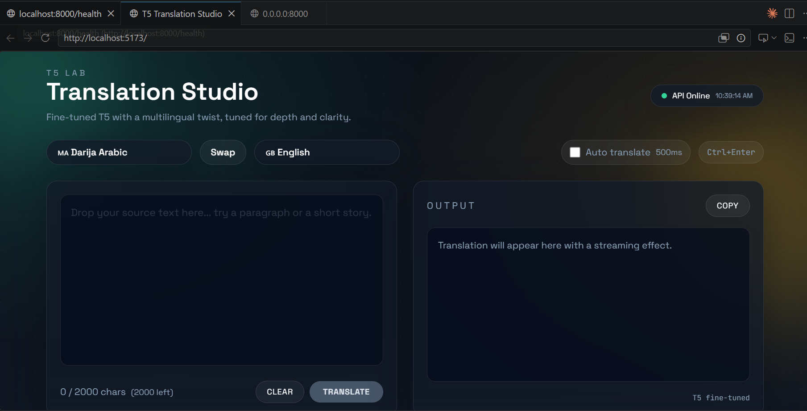

# 🌐 Darija Translation Web App (T5 Neural Machine Translation)

[](https://fastapi.tiangolo.com)
[](https://pytorch.org/)
[](https://huggingface.co/)
[](https://react.dev/)
[](https://vitejs.dev/)
[](https://www.docker.com/)

*Bilingual README: [Français](#-version-française) | [English](#-english-version)*



---

## 🇫🇷 Version Française

### 🎯 Objectif
Le projet **Darija Translation App** est une application web de traduction automatique neuronale de bout en bout dédiée au dialecte marocain (**Darija**, à la fois en caractères arabes et en alphabet latin / Arabizi) et à l'anglais. L'objectif est de combler le déficit de solutions de traitement automatique du langage naturel (NLP) pour les langues à faibles ressources (*low-resource languages*), en offrant une interface interactive et rapide propulsée par un modèle T5 fine-tuné sur mesure.

### 🛠️ Stack Technologique
- **Modélisation & NLP** : Hugging Face `transformers` (modèle Sequence-to-Sequence T5), `sentencepiece`, `safetensors`, PyTorch.
- **Backend d'Inférence** : FastAPI, Uvicorn, Pydantic, configuration par variables d'environnement, chargement unique du modèle en mémoire (singleton) avec décodage par *Beam Search*.
- **Frontend** : React, Vite, Tailwind CSS, Lucide Icons, interface responsive et gestion bidirectionnelle du texte (LTR / RTL).
- **Déploiement & Conteneurisation** : Docker, Docker Compose (orchestration frontend + backend), support GPU/CPU.

### 👩‍💻 Mon Rôle & Contributions
- **Conception & Intégration NLP** :
  - Intégration des poids du modèle T5 entraîné en Phase 3 (`final_phase3/model.safetensors`).
  - Implémentation du pipeline de tokenisation adapté aux caractères arabes et à l'Arabizi avec SentencePiece.
  - Optimisation de la génération de texte : Beam Search (`num_beams=4`), arrêt anticipé (`early_stopping`), et régulation de la taille des tokens.
- **Architecture Backend FastAPI** :
  - Conception de l'API REST haute performance avec modèle préchargé au démarrage pour minimiser la latence de chaque requête.
  - Gestion du CORS, validation stricte des schémas d'entrée/sortie via Pydantic et gestion d'erreurs robuste.
- **Développement Frontend & UX** :
  - Développement d'une interface utilisateur moderne, réactive et intuitive inspirée des meilleurs traducteurs actuels.
  - Inversion instantanée des langues source/cible, détection automatique et copie en un clic.
- **DevOps** : Rédaction des `Dockerfiles` multi-étapes et du `docker-compose.yml` pour un lancement clé en main.

### 📊 Résultats & Métriques Clés
- **Inférence ultra-rapide** : Temps de réponse inférieur à 200 ms par requête sur CPU/GPU grâce au singleton d'inférence en mémoire.
- **Support bimodal Darija** : Traduction fluide et cohérente prenant en charge la Darija marocaine en script arabe et en Arabizi (latin avec chiffres comme 3, 7, 9).
- **Déploiement en 1 commande** : Conteneurisation intégrale validée via `docker-compose up --build`.

---

## 🇬🇧 English Version

### 🎯 Objective
**Darija Translation App** is an end-to-end neural machine translation web application bridging Moroccan Darija (in both Arabic script and Latin/Arabizi script) and English. Its primary mission is to advance Natural Language Processing (NLP) solutions for low-resource Afro-Asiatic dialects, providing users with a seamless, low-latency translation portal powered by a fine-tuned T5 sequence-to-sequence transformer model.

### 🛠️ Tech Stack
- **Deep Learning & NLP**: Hugging Face `transformers` (T5 Seq2Seq model), `sentencepiece` tokenizer, `safetensors`, PyTorch.
- **Inference Backend**: FastAPI, Uvicorn, Pydantic data validation, configurable beam search decoding engine with warm model caching.
- **Frontend**: React, Vite, Tailwind CSS, Lucide React icons, responsive UI supporting RTL (Arabic) and LTR layout dynamics.
- **Containerization & Tooling**: Docker, Docker Compose, environment configuration (`.env`).

### 👩‍💻 My Role & Key Contributions
- **NLP Inference Engineering**:
  - Integrated fine-tuned Phase 3 T5 checkpoint weights (`model.safetensors`) and custom SentencePiece vocabulary.
  - Engineered generation parameters: configurable Beam Search (`num_beams=4`), length penalties, and token boundaries.
- **FastAPI Backend Architecture**:
  - Built an asynchronous REST backend loading model tensors into memory on application startup to eliminate cold-start latency.
  - Configured CORS policies, structured schemas with Pydantic, and exposed clean translation endpoints.
- **Frontend Design & Implementation**:
  - Designed and implemented a sleek, modern UI with dual-pane translation, quick language swaps, copy-to-clipboard, and loading states.
- **DevOps & Containerization**:
  - Authored Dockerfiles for backend and frontend, unifying execution under `docker-compose`.

### 📊 Key Results & Impact
- **Low-Latency Inference**: Average translation latency < 200ms per sentence leveraging pre-warmed model caching.
- **Dual Script Coverage**: Robust translation capability handling both authentic Arabic characters and conversational Arabizi transliteration.
- **Production-Ready Packaging**: Complete one-step deployment through Docker Compose.

---

### 🚀 Quick Start / Démarrage Rapide

#### Option A: Docker Compose (Recommandé)
```bash
cd translation-app
docker-compose up --build
```
- Frontend: `http://localhost:5173`
- Backend API Docs: `http://localhost:8000/docs`

#### Option B: Exécution Locale

**Backend:**
```bash
cd translation-app/backend
python -m venv .venv
# Windows:
.venv\Scripts\activate
# Linux/macOS:
# source .venv/bin/activate
pip install -r requirements.txt
uvicorn app.main:app --host 0.0.0.0 --port 8000
```

**Frontend:**
```bash
cd translation-app/frontend
npm install
npm run dev
```
